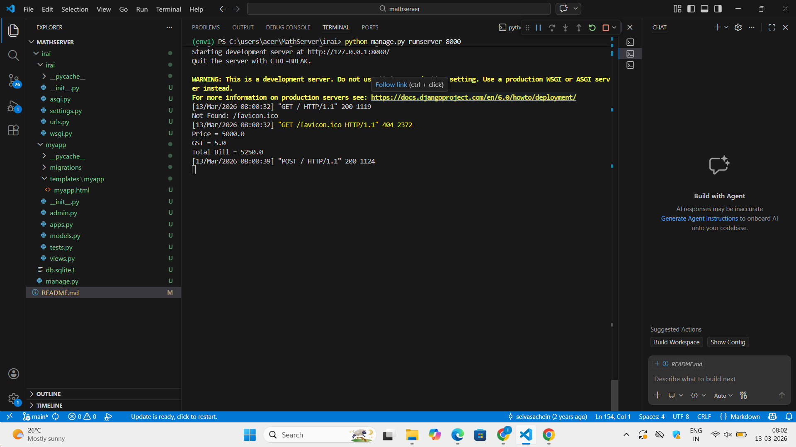
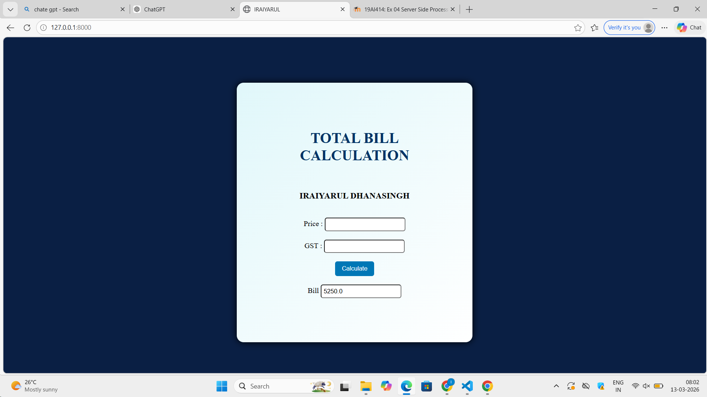

# Ex.04 Design a Website for Server Side Processing
## Date: 13/03/26

## AIM:
To create a web page to calculate total bill amount with GST from price and GST percentage using server-side scripts.

## FORMULA:
Bill = P + (P * GST / 100)
<br> P --> Price (in Rupees)
<br> GST --> GST (in Percentage)
<br> Bill --> Total Bill Amount (in Rupees)

## DESIGN STEPS:

### Step 1:
Clone the repository from GitHub.

### Step 2:
Create Django Admin project.

### Step 3:
Create a New App under the Django Admin project.

### Step 4:
Create a HTML file to implement form based input and output.

### Step 5:
Create python programs for views and urls to perform server side processing.

### Step 6:
Receive input values from the form using request.POST.get().

### Step 7:
Calculate the total bill amount (including GST).

### Step 8:
Display the calculated result in the server console.

### Step 9:
Render the result to the HTML template.

### Step 10:
Publish the website in Localhost.

## PROGRAM:
```
<html>
<head>
<title>IRAIYARUL</title>

<style>
body
{
    background-color: #0a1f44;   /* Dark Blue Background */
    text-align: center;
}

.box
{
    background: linear-gradient(135deg,#e0f7fa,#ffffff);
    padding: 80px;
    margin-left: 500px;
    margin-right: 500px;
    margin-top: 100px;
    border-radius: 15px;
    box-shadow: 0px 0px 15px black;
}

h1
{
    color: #003366;
}

input[type="submit"]
{
    background-color: #0077b6;
    color: white;
    padding: 8px 15px;
    border: none;
    border-radius: 5px;
}

input[type="text"]
{
    padding: 5px;
    border-radius: 5px;
}
</style>

</head>

<body>

<div class="box">

<h1>TOTAL BILL CALCULATION</h1><br>

<h3>IRAIYARUL DHANASINGH</h3>

<br>

<form method="post">



<label>Price : </label>
<input type="text" name="Price"><br><br>

<label>GST : </label>
<input type="text" name="GST"><br><br>

<input type="submit" value="Calculate"><br><br>

<label>Bill</label>
<input type="text" value="{{ bill }}">

</form>

</div>

</body>
</html>

views.py

from django.shortcuts import render

def calculate_bill(request):
    bill = 0

    if request.method == 'POST':
        p = float(request.POST.get('Price', 0))
        gst = float(request.POST.get('GST', 0))
        bill = p + (p * gst / 100)

        print("Price =", p)
        print("GST =", gst)
        print("Total Bill =", bill)

    return render(request, 'myapp/myapp.html', {'bill': bill})

    urls.py

    from django.contrib import admin
from django.urls import path
from myapp import views

urlpatterns = [
    path('admin/',admin.site.urls),
    path('', views.calculate_bill, name='calculate_bill'),
]
```
## OUTPUT - SERVER SIDE:


## OUTPUT - WEBPAGE:


## RESULT:
The a web page to calculate total bill amount with GST from price and GST percentage using server-side scripts is created successfully.
